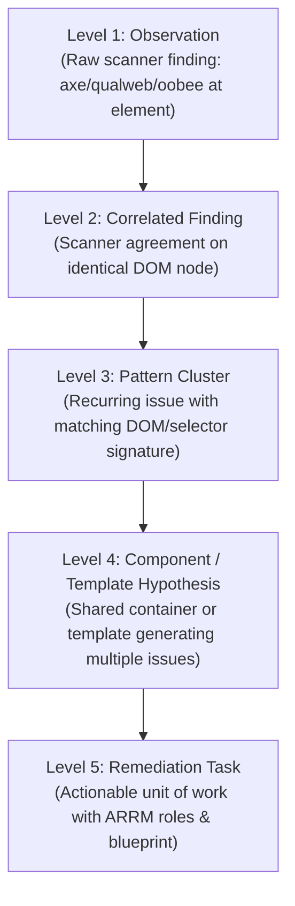

# Canonical Data Model & Finding Hierarchy

To preserve data provenance while correlating findings across multiple scanners, the Open Accessibility Workbench converts all inputs into a strict internal schema: the **Canonical Evidence Model**.

The model is **provenance-preserving**, not lossless: it retains each scanner's
upstream identities (finding, pattern, occurrence, duplicate metadata), the
originating scanner, and the raw evidence (rendered HTML, locator, message,
guidance). Every observation also carries `source.recordPointer` — a stable path
to the exact source record (a JSON-pointer-style `/results/{page}/{engine}/failures/{i}`
for Open Scans, `row:{i}` for the Oobee CSV) — plus `provenance.sourceRecordIndex`
and, where the scanner provides none, a Workbench-derived `identity.sourceFindingId`
(tagged `sourceFindingIdSource`). Together these let any normalized observation
be located in the original artifact and traced across four axes: **source report,
original record, scanner/tool, and page** (see `src/analysis/provenance.js` and
the Phase 4 provenance tests).

It does **not** yet store a hash of the source report or a verbatim copy of the
raw record, so a normalized observation cannot be byte-reconstructed from the
model alone. Fields a scanner does not provide are simply absent; the normalizers
do not invent values. (A source-report hash is tracked as a follow-up.)

---

## 1. Finding Hierarchy



1. **Level 1: Observation**: Raw scanner record on a specific page/element/rule.
2. **Level 2: Correlated Finding**: Multiple scanners describing the exact same underlying failure.
3. **Level 3: Pattern Cluster**: Multiple occurrences sharing structural DOM signatures and rule logic across one or many pages.
4. **Level 4: Component / Template Hypothesis**: Multiple pattern clusters sharing a common ancestor container or template location (e.g. site header, navigation bar, footer).
5. **Level 5: Remediation Task**: An actionable, role-routed unit of engineering or content work with clear implementation boundaries and verification steps.

---

## 2. Canonical Observation Schema

```typescript
interface CanonicalObservation {
  id: string; // Unique internal finding ID (or upstream preserved ID)
  schemaVersion: "1.0";
  source: {
    system: "open-scans" | "oobee" | "axe" | "custom";
    version: string | null;
    format: string; // e.g. "report.json", "report.csv"
    scanId: string;
    sourceReportId: string | null; // id in the workspace source-report registry
    importedAt: string; // ISO 8601
    originalRef: string | null;
    recordPointer: string; // stable path to the exact source record
                           // Open Scans: "/results/{page}/{engine}/failures/{i}"
                           // Oobee CSV:  "row:{i}"
  };
  page: {
    submittedUrl: string;
    finalUrl: string;
    title: string;
    browser: string | null;
    viewport: { width: number; height: number } | null;
    colorScheme: string | null;
  };
  classification: {
    sourceCategory: "mustFix" | "goodToFix" | "needsReview" | null;
    impact: "critical" | "serious" | "moderate" | "minor" | null; // null when unreported
    impactSource: "scanner" | "none"; // never fabricated from severity
    wcagLevel: "A" | "AA" | "AAA" | null;
  };
  rule: {
    sourceRuleId: string;
    normalizedRuleId: string;
    wcag: string[]; // e.g. ["2.4.4", "4.1.2"]
    actRules: string[];
  };
  evidence: {
    description: string;
    renderedHtml: string;
    locator: string; // CSS selector or XPath
    locatorType: "selector" | "xpath";
    scannerGuidance: string;
    helpUrl: string | null;
  };
  identity: {
    sourceFindingId: string | null;
    sourceFindingIdSource?: "upstream" | "workbench-derived"; // provenance of the id
    sourcePatternId: string | null;
    sourceOccurrenceId: string | null;
    sourceFingerprint: string | null;
  };
  duplicate: {
    sourceMarkedDuplicate: boolean;
    duplicateOf: string | null;
  };
  provenance: {
    scanner: string;
    sourceRecordIndex: number;
  };
  signatures?: {
    exactHtmlSignature: string;
    structureSignature: string;
    selectorSignature: string;
    semanticSignature: string;
  };
}
```

---

## 3. Remediation Task Schema

```typescript
interface RemediationTask {
  // STABLE, REPORT-SCOPED id: TASK-<sourceReportId>-<remediationFamily>-<hash of
  // sorted member pattern/cluster identities>. It does not depend on input order,
  // so task status stays attached to the same work across re-analysis, and never
  // collides between reports.
  id: string;
  title: string;
  summary: string;
  ruleId: string;         // the task's primary rule (stable within its family)
  ruleIds: string[];      // every rule consolidated into this task (sorted)
  remediationFamily: string; // the implementation action (e.g. "accessible-name",
                             // "contrast"); tasks consolidate by component AND family
  consolidated: boolean;  // true when >1 pattern cluster was merged
  patternClusterIds: string[]; // the pattern clusters this task covers
  wcag: string[];
  urgency: "critical" | "high" | "medium" | "low";
  leverage: "very-high" | "high" | "medium" | "low";
  metrics: {
    observationCount: number;
    correlatedFindingCount: number;
    patternVariantCount: number; // number of pattern clusters consolidated
    affectedPagesCount: number;
    totalPagesCount: number;
    pagesPercentage: number;
  };
  componentHypothesis: {
    name: string;
    confidence: "high" | "medium" | "low";
    rationale: string;
  } | null;
  roles: {
    primary: string;
    coPrimary: string[];
    secondary: string[];
    contributors: string[];
    source: "w3c-arrm" | "workbench-inference";
  };
  technologyContext: {
    name: string | null;
    category: string | null;
    confidence: "high" | "medium" | "low" | "none";
    source: "user" | "metadata" | "detector" | "heuristic" | "none";
  };
  blueprint: {
    problem: string;
    systemicRationale: string;
    likelyRootCause: string;
    whatNeedsToChange: string;
    humanDecisionsRequired: string[];
    targetMarkup: string | null;
    verificationSteps: string[];
  };
  observations: CanonicalObservation[];
}
```

## 4. Task lifecycle & status storage

Task status is tracked separately from the derived task objects (in
`src/state/task-status.js`) so it survives re-analysis without altering evidence.

Lifecycle states: `new` (default, untriaged), `ready` (triaged, actionable),
`in-progress`, `blocked` (external dependency), `needs-decision` (unresolved human
decision), `needs-verification` (implemented, not yet accessibility-verified),
`done`, `deferred` (intentional not-now). `new`/`ready`/`blocked`/`deferred` are
deliberately distinct so untriaged, actionable, externally-blocked, and
intentionally-postponed work are never conflated.

**Storage scope.** Status is keyed by the stable, report-scoped task id, so it
cannot transfer between tasks (order-independent ids) or between reports
(report-scoped ids). Persistence is **opt-in** via a control in the task list;
when off, status lives only in memory for the session. Only task statuses are
stored — never report evidence. A stored schema is migrated on load (legacy
`open` → `new`) and unknown states are dropped. See PRIVACY.md.

### Known limitations
- Task titles/blueprints for a family are drawn from the family's first
  (sorted) member cluster; this is safe because a family is homogeneous by
  construction, but multi-example rendering per family is not yet implemented.
- A source-report content hash is stored, but observations are not yet
  byte-reconstructable from the model (see §2).
