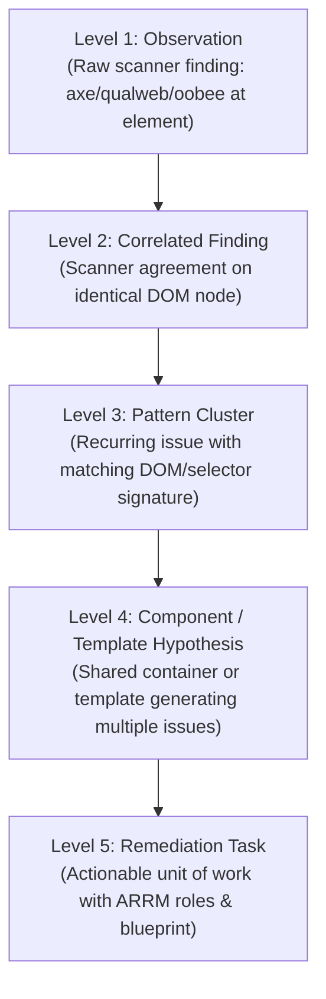

# Canonical Data Model & Finding Hierarchy

To preserve data provenance while correlating findings across multiple scanners, the Open Accessibility Workbench converts all inputs into a strict internal schema: the **Canonical Evidence Model**.

The model is **provenance-preserving**, not lossless: it retains each scanner's
upstream identities (finding, pattern, occurrence, duplicate metadata), the
originating scanner and record index, and the raw evidence (rendered HTML,
locator, message, guidance). It does **not** currently store a hash of the source
report, a stable JSON Pointer to the originating record, or a verbatim copy of
the raw record — so a normalized observation cannot yet be byte-reconstructed
from the model alone. Fields a scanner does not provide are simply absent; the
normalizers do not invent values. (Adding a `source.recordPointer` and a source
hash is tracked as a follow-up.)

---

## 1. Finding Hierarchy



1. **Level 1: Observation**: Raw scanner record on a specific page/element/rule.
2. **Level 2: Correlated Finding**: Multiple scanners describing the exact same underlying failure.
3. **Level 3: Pattern Cluster**: Multiple occurrences sharing structural DOM signatures and rule logic across one or many pages.
4. **Level 4: Component / Template Hypothesis**: Multiple pattern clusters sharing a common ancestor container or template location (e.g. site header, navigation bar, footer).
5. **Level 5: Remediation Task**: An actionable, role-routed unit of engineering or content work with clear implementation boundaries and verification steps.

---

## 2. Canonical Observation Schema

```typescript
interface CanonicalObservation {
  id: string; // Unique internal finding ID (or upstream preserved ID)
  schemaVersion: "1.0";
  source: {
    system: "open-scans" | "oobee" | "axe" | "custom";
    version: string | null;
    format: string; // e.g. "report.json", "report.csv"
    scanId: string;
    importedAt: string; // ISO 8601
    originalRef: string | null;
  };
  page: {
    submittedUrl: string;
    finalUrl: string;
    title: string;
    browser: string | null;
    viewport: { width: number; height: number } | null;
    colorScheme: string | null;
  };
  classification: {
    sourceCategory: "mustFix" | "goodToFix" | "needsReview" | null;
    impact: "critical" | "serious" | "moderate" | "minor" | null;
    wcagLevel: "A" | "AA" | "AAA" | null;
  };
  rule: {
    sourceRuleId: string;
    normalizedRuleId: string;
    wcag: string[]; // e.g. ["2.4.4", "4.1.2"]
    actRules: string[];
  };
  evidence: {
    description: string;
    renderedHtml: string;
    locator: string; // CSS selector or XPath
    locatorType: "selector" | "xpath";
    scannerGuidance: string;
    helpUrl: string | null;
  };
  identity: {
    sourceFindingId: string | null;
    sourcePatternId: string | null;
    sourceOccurrenceId: string | null;
    sourceFingerprint: string | null;
  };
  duplicate: {
    sourceMarkedDuplicate: boolean;
    duplicateOf: string | null;
  };
  provenance: {
    scanner: string;
    sourceRecordIndex: number;
  };
  signatures?: {
    exactHtmlSignature: string;
    structureSignature: string;
    selectorSignature: string;
    semanticSignature: string;
  };
}
```

---

## 3. Remediation Task Schema

```typescript
interface RemediationTask {
  id: string; // e.g. "TASK-link-name-social-links"
  title: string;
  summary: string;
  ruleId: string;
  wcag: string[];
  urgency: "critical" | "high" | "medium" | "low";
  leverage: "very-high" | "high" | "medium" | "low";
  metrics: {
    observationCount: number;
    correlatedFindingCount: number;
    affectedPagesCount: number;
    totalPagesCount: number;
    pagesPercentage: number;
  };
  componentHypothesis: {
    name: string;
    confidence: "high" | "medium" | "low";
    rationale: string;
  } | null;
  roles: {
    primary: string;
    secondary: string[];
    contributors: string[];
    source: "W3C ARRM" | "Workbench WCAG 2.2 Extension";
  };
  technologyContext: {
    name: string | null;
    category: string | null;
    confidence: "high" | "medium" | "low" | "none";
    source: "user" | "metadata" | "detector" | "heuristic" | "none";
  };
  blueprint: {
    problem: string;
    systemicRationale: string;
    likelyRootCause: string;
    whatNeedsToChange: string;
    humanDecisionsRequired: string[];
    targetMarkup: string | null;
    verificationSteps: string[];
  };
  observations: CanonicalObservation[];
}
```
